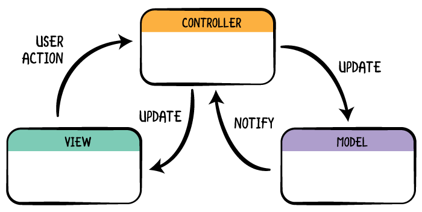

<!-- PROJECT LOGO -->
<br />
<p align="center">
  <h1 align="center">Swiftly ✨</h1>

  <p align="center">
    My journey through learning swift as a flutter developer
    <br />
    <br />
    <a href="https://hashirshoaeb.com">About Me</a>
  </p>
</p>


[](https://twitter.com/hashirshoaeb)
[](https://github.com/hashirshoaeb/star_book/blob/master/LICENSE)

<!-- A collapsible section containing code -->
<!-- https://luciopaiva.com/markdown-toc/ -->
### **Table of contents**
<details>
  <summary>Click to expand!</summary>

  - [Introduction](#introduction)
- [Data types](#data-types)
  - [String](#string)
  - [Double](#double)
  - [Boolean](#boolean)
  - [`var` vs `let`](#var-vs-let)
- [Collection](#collection)
  - [Array](#array)
  - [Tuples](#tuples)
  - [Dictionaries](#dictionaries)
  - [Creating empty collections](#creating-empty-collections)
  - [Enumerations](#enumerations)
- [Arithmetic operators](#arithmetic-operators)
- [Keywords](#keywords)
- [Conditions](#conditions)
  - [ternary operator](#ternary-operator)
  - [Switch statements](#switch-statements)
  - [Range operators](#range-operators)
- [Loops](#loops)
  - [for-in loops](#for-in-loops)
  - [while loops](#while-loops)
- [Function](#function)
  - [void](#void)
  - [Closures / Callbacks](#closures--callbacks)
- [Struct](#struct)
- [Strings](#strings)
- [This / Self](#this--self)
- [Class](#class)
  - [Inheritance](#inheritance)
  - [destructor](#destructor)
  - [Mutability](#mutability)
- [Protocol](#protocol)
  - [Extension](#extension)
  - [Abstract class](#abstract-class)
- [Class vs Struct](#class-vs-struct)
- [Design Patterns](#design-patterns)
  - [MVC](#mvc)
  - [Delegate Pattern](#delegate-pattern)
- [VIP Architecture](#vip-architecture)
- [Declarative vs Imperative](#declarative-vs-imperative)
- [Build an App](#build-an-app)

</details>

<br/>

# Introduction

If you are already familiar with one programming language, learning a new programming language becomes a little easy. Since most of the concepts are common between programming languages i.e (variable, functions, loops, conditional statements etc). So the base concepts are same. All you need to learn is syntax. Same in my case. By the time I started learning swift I already had 1.5 years of experience with dart. For me it was very easy and interesting to learn and compare swift with dart. Following is my journey of learning swift as a flutter developer. I hope my journey will ease your learning of swift.

# Data types

Swift is **type-safe** language. `var` keyword assigns the type. Unlike Javascript, types are not interchangeable.

```swift
var str = "greetings"
str = 7 // error
```

Swift lets you use underscores as thousands separators – they don’t change the number, but they do make it easier to read. For example:

```swift
var population = 8_000_000 // 8000000
```

It makes the numbers easier to read. (sugar syntax)

## **String**

To create String use double quotes (””). 

```swift
var str = "Hello world"
```

### Multiline

To create multiline string use double quotes thrice(“””). quotes should always be in new line.

```swift
var multiline = """
this is cute 
multiline
string 
"""
```

If you only want multi-line strings to format your code neatly, and you don’t want those line breaks to actually be in your string, end each line with a **`\`**, like this:

```swift
var str2 = """
This goes \
over multiple \
lines
"""
```

**Tip:**
 Sometimes you will want to have long strings of text in your code without using multiple lines, but this is quite rare. Specifically, this is most commonly important if you plan to share your code with others – if they see an error message in your program they might want to search your code for it, and if you’ve split it across multiple lines their search might fail.

### String interpolation

want to add variable inside string? simply add backslash and put variable inside round brackets.

```swift
var score = 85
var str = "Your score was \(score)" // Your score was 85
```

### String interpolation with custom types

```swift
struct Person {
    var type: String
    var action: String
}

extension String.StringInterpolation {
    mutating func appendInterpolation(_ person: Person) {
        appendLiteral("I'm a \(person.type) and I'm gonna \(person.action).")
    }
}

let hater = Person(type: "hater", action: "hate")
print("Status check: \(hater)")
```

for more [https://www.hackingwithswift.com/articles/178/super-powered-string-interpolation-in-swift-5-0](https://www.hackingwithswift.com/articles/178/super-powered-string-interpolation-in-swift-5-0)

## **Double**

Save floating points

```swift
var floating = 2.099
var myInteger = 6 // Note that this is interger type not double
var myDouble = 6.0 // this is type double
```

As before, data types in swift are not interchangeable. Similarly we cannot perform operations

```swift
var total = myInteger + myDouble // error
```

## **Boolean**

Saves either `true` or `false`.

```swift
var awesome = true
var isLoaded = 1 // this is not type boolean
```

## **`var` vs `let`**

**`var`** is a mutable variable. Value in variable with **`var`** can be changed over time.

**`let`** is and immutable variable. Value in variable with **`let`** cannot be changed once assigned. in dart or c++ it is refered as `const`

If you try to change value in **`let`**, Xcode will refuse to run your code. It’s a form of safety: when you use constants you can no longer change something by accident.

When you write your own Swift code, you should always use **`let`** unless you specifically want to change a value. In fact, Xcode will warn you if you use **`var`** then *don’t* change the variable.

**`let`** , `var` also accepts late assignment. means declare first and assign later. make sure to assign before using it. btw compiler is intelligent enough to point out. 

```swift
var awesome = true
awesome = false

let awesome = true
awesome = false // error
```

### Type annotations vs Type inference

**Type inference** refers to the automatic detection of the type of an expression in a formal language. But some time it is better to define types 

```swift
let album: String = "Reputation"
let year: Int = 1989
let height: Double = 1.78
let taylorRocks: Bool = true
let customType: CustomType = CustomType()
```

### When to use type annotation

The answer to the first question is primarily one of three reasons:

1. Swift can’t figure out what type should be used.
2. You want Swift to use a different type from its default.
3. You don’t want to assign a value just yet.

# Collection

## **Array**

Sequence of same type values. It is a value type data structure.

```swift
// 1d
let beatles : [String] = ["john", "paul", "george", "ringo"]
beatles[0] // "john"
// 2d
let beatles : [[String]] = [["john"], ["paul"], ["george"], ["ringo"]]
beatles[0][0] // "john"
beatles[0][1] // Error index out of range
```

### Set

Like array but with 2 conditions 

- no order
- no duplicates

```swift
let colors2 = Set(["red", "green", "blue", "red", "blue"]) // {"green", "blue", "red"}
```

## **Tuples**

Tuples allow you to store several values together in a single value. That might sound like arrays, but tuples are different:

1. You can’t add or remove items from a tuple; they are fixed in size.
2. You can’t change the type of items in a tuple; they always have the same types they were created with.
3. You can access items in a tuple using numerical positions or by naming them, but Swift won’t let you read numbers or names that don’t exist.

Tuples are created by placing multiple items into parentheses, like this:

```swift
var name = (first: "Taylor", last: "Swift")
print(name.0) // Taylor
```

For more: [Why is it any different from class and structure?](https://www.hackingwithswift.com/quick-start/understanding-swift/whats-the-difference-between-a-struct-and-a-tuple)

## **Dictionaries**

key value pair of data collection. i.e (json like sructure), (refered as maps in dart). 

```swift
let heights = [
    "Taylor Swift": 1.78,
    "Ed Sheeran": 1.73
]
let heights : [String: Double] = [
    "Taylor Swift": 1.78,
    "Ed Sheeran": 1.73
]

heights["Taylor Swift", default: 1.78]
```

## **Creating empty collections**

```swift
// ARRAY
var results = [Int]()
var results = Array<Int>()
// SET
var words = Set<String>()
// DICTIONARY
var teams = [String: String]()
var scores = Dictionary<String, Int>()
```

## **Enumerations**

Enumerations – usually called just *enums* – are a way of defining groups of related values in a way that makes them easier to use. 

```swift
enum Result {
    case success
    case failure
}

enum Planet: Int {
    case mercury = 1
    case venus
    case earth
    case mars
}
// Now Swift will assign 1 to mercury and count upwards from there, meaning that earth is now the third planet.
```


### Associate a value with an enum

Enums are very powerful in swift. Read more: [https://www.avanderlee.com/swift/enumerations/](https://www.avanderlee.com/swift/enumerations/)

# Arithmetic operators
| Name | operator |
| --- | --- |
| Add | + |
| Subtract | - |
| Multiply | * |
| Divide | / |
| Remainder / Modulo | % |

# Keywords

`nil` is like `null` in in dart. It is a special value that represents an absence of a value.

Null safety

```swift
var count : Int? = nil
// usuall way
if count == nil {
    print("count is nil")
}else {
    print("count has \(count)")
}

// swift's way
// this let us un wrap the value from optionals
if let nonNullCount = count {
		// nonNullCount is only available in this scope
    print("count has \(nonNullCount)")
} else {
    print("count is nil")
}

// similarly 
func greet(_ name: String?) {
		// guard let you make the variable non null
		// and can be used later down in the scope.
    guard let unwrapped = name else {
        print("You didn't provide a name!")
        return
    }

    print("Hello, \(unwrapped)!")
}
```

force unwrapping: force non null using `!`

**Implicitly unwrapped optionals**

Implicitly unwrapped optionals can contain a value or be nil, and regular optionals can also contain a value or be nil, but there’s a subtle difference: implicitly unwrapped optionals don’t need to be unwrapped to be used. This means if you attempt to use an implicitly unwrapped optional and it’s actually nil, your code will just crash – Swift won’t make you use **`if let`** or similar like it would with regular optionals. Althought try to avoid this as much as possible but this is a very useful feature, because it means you can use an implicitly unwrapped optional without having to worry about whether it’s nil or not. 

```swift
let age: Int! = nil 
print(age) // nil
let age2: Int = age // error because I implicitly make the age non nil, but in actual, value in age is nil and age2 demands non nilable type

```

**Nil coalescing**

```swift
let user = username(for: 15) ?? "Anonymous"
```

**Optional chaining**

```swift
let beatle = names.first?.uppercased()
```

**try catch**

```swift
//  if function returns nil instead of throwing error with this syntax
if let result = try? checkPassword("password") {
    print("Result was \(result)")
} else {
    print("D'oh.")
}

// if null then code crash 
try! checkPassword("sekrit")
print("OK!")
```

**fail-able constructor**

```swift
struct Person {
    var id: String

    init?(id: String) {
        if id.count == 9 {
            self.id = id
        } else {
            return nil
        }
    }
} 
```

**type-casting**

```swift
if let dog = pet as? Dog {
        dog.makeNoise()
    }
```

# Conditions

```swift
if firstCard + secondCard == 2 {
    print("Aces – lucky!")
} else if firstCard + secondCard == 21 {
    print("Blackjack!")
} else {
    print("Regular cards")
}

if age1 > 18 && age2 > 18 {
    print("Both are over 18")
}

if age1 > 18 || age2 > 18 {
    print("At least one is over 18")
}

if (isOwner == true && isEditingEnabled) || isAdmin == true {
    print("You can delete this post")
}
```

## **ternary operator**

```swift
print(firstCard == secondCard ? "Cards are the same" : "Cards are different")
```

## **Switch statements**

Swift will only run the code inside each case. If you want execution to continue on to the next case, use the `fallthrough`  keyword like this:

```swift
switch weather {
case "rain":
    print("Bring an umbrella")
case "snow":
    print("Wrap up warm")
case "sunny":
    print("Wear sunscreen")
    fallthrough
default:
    print("Enjoy your day!")
}
```

## **Range operators**

Swift gives us two ways of making ranges: the **`..<`** and **`...`** operators. The half-open range operator, **`..<`**, creates ranges up to but excluding the final value, and the closed range operator, **`...`**, creates ranges up to and *including* the final value.

For example, the range **`1..<5`** contains the numbers 1, 2, 3, and 4, whereas the range **`1...5`** contains the numbers 1, 2, 3, 4, and 5.

Ranges are helpful with **`switch`** blocks, because you can use them for each of your cases. For example, if someone sat an exam we could print different messages depending on their score:

```swift
let score = 85

switch score {
case 0..<50:
    print("You failed badly.")
case 50..<85:
    print("You did OK.")
default:
    print("You did great!")
}
```

```swift
let count: ClosedRange<Int> = 1...10
let count: Range<Int> = 1..<10
```

More on [https://www.avanderlee.com/swift/ranges-explained/](https://www.avanderlee.com/swift/ranges-explained/)

# Loops

## **for-in loops**

```swift
for number in count {
    print("Number is \(number)")
}

// use _ if variable is unused 
for _ in 1...5 {
    print("play")
}
```
## **while loops**

```swift
while number <= 20 {
    print(number)
    number += 1
	break
}
```

repeat like a ⇒ `do while` 

```swift
repeat {
    print(number)
    number += 1
} while number <= 20
```

**exiting multiple loops**

```swift
outerLoop: for i in 1...10 {
    for j in 1...10 {
        let product = i * j
        print ("\(i) * \(j) is \(product)")

        if product == 50 {
            print("It's a bullseye!")
            break outerLoop
        }
    }
}
```

**skipping items ⇒ use `continue`**

```swift
for i in 1...10 {
    if i % 2 == 1 {
        continue
    }

    print(i)
}
```

# Function

## **void**

```swift
func printHelp() {
    print(message)
}
```
```swift
func printHelp() -> Void {
    print(message)
}
```

**parameters / arguments**

```swift
func square(number: Int) {
    print(number * number)
}
square(number: 8)
```

**parameter labels**

Swift lets us provide two names for each parameter: one to be used externally when calling the function, and one to be used internally inside the function.

```swift
func sayHello(to name: String) {
    print("Hello, \(name)!")
}
```

Note: swift does not support positional parameters, it strictly uses named parameters. 

to make positional use hyphen `_`

```swift
func print(_ name: String, _ age : Int) {

}
print("hello" , 23)
```

default parameters 

```swift
func print(_ name: String, _ age : Int = 23) {

}
print("hello")
```

**return type**

```swift
func square(number: Int) -> Int {
    return number * number
}
let result = square(number: 8)
print(result)
```

one line code does not require to write `return` 

```swift
func greet(name: String) -> String {
    "Oh wow!"
}
```

**Variadic functions**

Swift’s variadic functions let us accept any number of parameters of the same type, separated by a comma.

```swift
func square(numbers: Int...) {
    for number in numbers {
        print("\(number) squared is \(number * number)")
    }
}

square(numbers: 1, 2, 3, 4, 5)
// 1 squared is 1
// 2 squared is 4
// 3 squared is 9
// 4 squared is 16
// 5 squared is 25
```

**function to throw error**

```swift
enum PasswordError: Error {
    case obvious
}

func checkPassword(_ password: String) throws -> Bool {
    if password == "password" {
        throw PasswordError.obvious
    }

    return true
}
```

Note: Function can only `throw` errors of type `Error` that is why we extended `PasswordError` from `Error` . Error in other words Exception. 

More on: [https://www.donnywals.com/working-with-throwing-functions-in-swift/](https://www.donnywals.com/working-with-throwing-functions-in-swift/)

Handle throwing errors

```swift
do {
    try checkPassword("password")
    print("That password is good!")
} catch {
    print("You can't use that password.")
}
```

mutable and immutable parameters 

by default parameters are constant type. but if you want mutable types then use `inout`

```swift
func doubleInPlace(number:inout Int) {
    number *= 2
}
var myNum = 10 
doubleInPlace(number: &myNum)
```

## **Closures / Callbacks**

create a function and assign to a variable

```swift
let driving = {
    print("I'm driving in my car")
}

driving()

// type annotation
let typedVariable : () -> () = driving
```

accepting parameters

Note: closures does not have named parameters 

```swift
let driving = { (place: String) in
    print("I'm going to \(place) in my car")
}
driving("London")

// type annotation
let typedVariable : (String) -> () = driving
```

returning value 

```swift
let drivingWithReturn = { (place: String) -> String in
    return "I'm going to \(place) in my car"
}
let message = drivingWithReturn("London")
print(message)

// type annotation
let typedVariable : (String) -> String = drivingWithReturn
```

Closures as parameters

```swift
// let driving = { () -> Void in
let driving = { () -> () in
     print("I'm going to in my car")
}

// func travel(action: () -> Void) {
func travel(action: () -> ()) {
    print("I'm getting ready to go.")
    action()
    print("I arrived!")
}

travel(action: driving)
```

**Trailing closure syntax**

If the last parameter to a function is a closure, Swift lets you use special syntax called trailing closure syntax. Rather than pass in your closure as a parameter, you pass it directly after the function inside braces.

```swift
func travel(action: () -> Void) {
    print("I'm getting ready to go.")
    action()
    print("I arrived!")
}

travel() {
    print("I'm driving in my car")
}

travel {
    print("I'm driving in my car")
}
```

i little complex example

```swift
func travel(action: (String) -> Void, action2: (String) -> Void) {
    print("I'm getting ready to go.")
    action("Car")
    print("I arrived!")
}

func message(type : String) {
    print("I'm driving \(type)")
}

// without Trailing closure syntax
travel(
    action: { (str: String) -> Void in
    print("I'm driving \(str)")
},
    action2: message
)

// with Trailing closure syntax
travel { (str: String) -> Void in
    print("I'm driving \(str)")
} action2: { (str: String) -> Void in
    print("I'm driving \(str)")
}
```

example and use

```swift
func reduce(values : [Int], callback: (Int, Int)-> Int) -> Int {
    // start with a total equal to the first value
    var current = values[0]

    // loop over all the values in the array, counting from index 1 onwards
    for value in values[1...] {
        // call our closure with the current value and the array element, assigning its result to our current value
        current = callback(current, value)
    }

    // send back the final current value
    return current
}

func add(a: Int, b: Int) -> Int {
    return a + b
}

reduce(values: [1 ,2 ,3 ,4 ,5 ,6 ,7 ,8 , 9, 10], callback: add)
```

More about function returning callback [https://www.hackingwithswift.com/quick-start/understanding-swift/why-do-swifts-closures-capture-values](https://www.hackingwithswift.com/quick-start/understanding-swift/why-do-swifts-closures-capture-values)

# Struct
A structure is a way to group data together to form a single compound value. 

```swift
struct Sport {
		// store property 
    var name: String
    var isOlympicSport: Bool
		// computed property
    var olympicStatus: String {
        if isOlympicSport {
            return "\(name) is an Olympic sport"
        } else {
            return "\(name) is not an Olympic sport"
        }
    }
}
```

**property observers**

```swift
struct Progress {
    var task: String
    var amount: Int {
        didSet {
            print("\(task) is now \(amount)% complete")
        }
				
    }
}
```

Function in struct is called method

```swift
struct City {
    var population: Int

    func collectTaxes() -> Int {
        return population * 1000
    }
}
```

preventing const properties to be able to mutate.

If a struct has a variable property but the instance of the struct was created as a constant, that property can’t be changed – the struct is constant, so all its properties are also constant regardless of how they were created. 

The problem is that when you create the struct Swift has no idea whether you will use it with constants or variables, so by default it takes the safe approach: Swift won’t let you write methods that change properties unless you specifically request it.

When you *want* to change a property inside a method, you need to mark it using the **`mutating`** keyword, like this:

```swift
struct Person {
    var name: String

    mutating func makeAnonymous() {
        name = "Anonymous"
    }
}
```

```swift
init() {
        username = "Anonymous"
        print("Creating a new user!")
    }
```

# Strings

Unlike others Strings in swift are structs not arrays 

More on: [https://www.hackingwithswift.com/articles/181/why-using-isempty-is-faster-than-checking-count-0](https://www.hackingwithswift.com/articles/181/why-using-isempty-is-faster-than-checking-count-0)

# This / Self

Instead of `this` swift has `self`.

# Class

```swift
class Dog {
    var name: String
    var breed: String

    init(name: String, breed: String) {
        self.name = name
        self.breed = breed
    }
}
```

- Classes do not come with synthesized memberwise initializers.
- One class can be built upon (“inherit from”) another class, gaining its properties and methods.
- Copies of structs are always unique, whereas copies of classes actually point to the same shared data.
- Classes have deinitializers, which are methods that are called when an instance of the class is destroyed, but structs do not.
- Variable properties in constant classes can be modified freely, but variable properties in constant structs cannot.

## **Inheritance**

```swift
class Poodle: Dog {
    init(name: String) {
        super.init(name: name, breed: "Poodle")
    }
}
```

Note: `final` keyword does not allow you to change or override or extend the behaviour of the class.

```swift
final class Dog {
var name: String
var breed: String

init(name: String, breed: String) {
self.name = name
self.breed = breed
    }
}
```

## **destructor**

```swift
class Person {
    var name = "John Doe"
		
		// constructor 
    init() {
        print("\(name) is alive!")
    }

    func printGreeting() {
        print("Hello, I'm \(name)")
    }
		// destructor
		deinit {
	    print("\(name) is no more!")
	}
}
```

## **Mutability**

The final difference between classes and structs is the way they deal with constants. If you have a constant struct with a variable property, that property can’t be changed because the struct itself is constant.

However, if you have a constant *class* with a variable property, that property *can* be changed. Because of this, classes don’t need the **`mutating`** keyword with methods that change properties; that’s only needed with structs.

This difference means you can change any variable property on a class even when the class is created as a constant – this is perfectly valid code:

```swift
class Singer {
var name = "Taylor Swift"}

let taylor = Singer()
taylor.name = "Ed Sheeran"print(taylor.name)
```

# **Protocol**

Protocols are like interfaces.

So, protocols let us create blueprints of how our types share functionality, then use those blueprints in our functions to let them work on a wider variety of data.

```swift
protocol Identifiable {
    var id: String { get set }
}

struct User: Identifiable {
    var id: String
}

func displayID(thing: Identifiable) {
    print("My ID is \(thing.id)")
}
```

### Inheritance

One protocol can inherit from another in a process known as *protocol inheritance*. Unlike with classes, you can inherit from multiple protocols at the same time before you add your own customisations on top.

```swift
protocol Payable {
    func calculateWages() -> Int
}

protocol NeedsTraining {
    func study()
}

protocol HasVacation {
    func takeVacation(days: Int)
}

protocol Employee: Payable, NeedsTraining, HasVacation { }
```

## **Extension**

Extensions allow you to add methods to existing types (class, structs, protocols etc), to make them do things they weren’t originally designed to do. But you cannot add properties. Only methods allowed

```swift
extension Int {
    var isEven: Bool {
        return self % 2 == 0
    }
}
```

## **Abstract class**

Sadly there is not such thing in swift. But here is an alternative. using protocol and extensions. `protocol` creates a blueprint and `extension` gives the default implementation. just like abstract classes. 

```swift
protocol Identifiable {
    var id: String { get set }
    func identify()
}

extension Identifiable {
    func identify() {
        print("My ID is \(id).")
    }
}
```

More on: [https://developer.apple.com/videos/play/wwdc2015/408/](https://developer.apple.com/videos/play/wwdc2015/408/)

# Class vs Struct

classes are reference types 

structs are value type

note: Always make value types equatable. 

# Design Patterns

## MVC
MVC stands for Model View Controller. But in iOS it is also know as Massive View Controller due to the massive size of ViewController class over time.



communication happen between controller via delegates.

## Delegate Pattern

Delegate pattern is like Observer pattern. Difference is that In Observer there is One to Many (1-to-m) communication. And in delegates there is One to One (1-to-1) communication.

```swift
// Suppose this is a view
struct View {
    var label : String {
        didSet {
            print("UI Updated: \(label)")
        }
    }
}

// Model that holds data
struct Model {
    var data : String
}

// API that will end data
class Api {
    
    var delegate : Delegate
    
    init(delegate: Delegate){
        self.delegate = delegate
    }
    
    func getData() {
        delegate.onData(data: Model(data: "Awesome Data from API"))
    }
}

// Delegate to observe onData arrived.
protocol Delegate {
    func onData(data: Model)
}

class ViewController {
    
    var view = View(label: "")
    
		// loades the screen
    func screendidLoad(){
        print("Screen Loaded")
        view.label = "NO DATA"
        print("waiting for 5 sec")
        let api = Api(delegate: self)
        api.getData()
    }
}

// Conforms delegate, wirte the implementaion on data arrival.
extension ViewController : Delegate {
    func onData(data: Model) {
        view.label = "HAS DATA: \(data.data)"
    }
}

// main
var inctance = ViewController()
inctance.screendidLoad()
```

Output:

```
Screen Loaded
UI Updated: NO DATA
waiting for 5 sec
UI Updated: HAS DATA: Awesome Data from API
```

Box technique: [https://holyswift.app/reactive-swift-the-boxing-technique](https://holyswift.app/reactive-swift-the-boxing-technique)

mvvm: https://github.com/borderfree/imdb-mvvm

# VIP Architecture

# Declarative vs Imperative

Imperative is “How you do something”
Declarative is “What you do”

[https://www.youtube.com/watch?v=E7Fbf7R3x6I](https://www.youtube.com/watch?v=E7Fbf7R3x6I)

Declarative way is generally a better approach for write easy to understand code.

Many bugs come from the changing state, and assignment (mutation) statements that perform changes “=” are often the root cause of all evil in universe. 

the bigger takeaway that writing reliable software is all about properly managing complexity.

What we can do is we can take our imperative code and abstract it behind a declarative api. In fact many (if not all) declarative apis have some sort of underlying imperative implementation. 

Note: good declarative approach should conforms with the mental model of the developer(human) rather than the operational model of the machine.


# Build an App

**CREDITS**
- [Hacking With Swift](https://www.hackingwithswift.com/100)